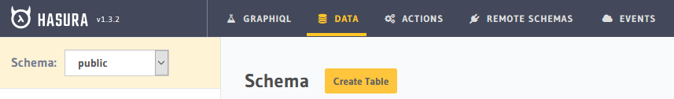
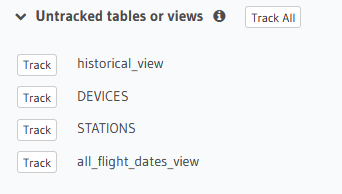

## Importing Data
Currently you have an empty database. If you'd like to import a postgres dump file from another source, follow these steps. We have several dump files stored that have schemas compatible with the MURI Live UI display. If you use custom message definitions, know that MURI Live may not be able to read different JSON nesting and naming conventions. However this can be edited in the MURI Live repo.  
This example is using two VPS servers for data transfer via scp/ssh. There may be better solutions such as ftp depending on how your data is stored.

### SSH config
SSH communication will need to be set up in order to transfer the data dump.  
From the server with the data, generate a new ssh key pair via this command:

``
ssh-keygen
``
Set up a password and a custom name for your key if desired. From here, you'll want to copy the public key to the ``authorized_keys`` file in the target server. To do so, you can run the following commands:

``
cat {key.pub}
``
Copy the output to your clipboard, either manually or with software like [xclip](https://stackoverflow.com/questions/5130968/how-can-i-copy-the-output-of-a-command-directly-into-my-clipboard)

On the target server, the authorized keys folder should be located at ``/root/.ssh``. Once in the directory, copy the contents into the file.  

Finally restart the ssh service with this command:
```
sudo service ssh restart
```

You can then test that the ssh setup works by ssh'ing into the target server:

```
ssh -i ~/.ssh/{YOUR_KEY} {YOUR_USER}@{TARGET_SERVER}
```

## Data transfer

Start by dumping the data with the following command:
```
docker exec -t {YOUR_IMAGE_ID} pg_dumpall -c -U postgres | gzip > {YOUR_DIR}/dump_$(date +"%Y-%m-%d_%H_%M_%S").gz
```
Note that this also zips the dump file and outputs it to ``YOUR_DIR``. After verifying that the dump was succesful, run the following command.
```
scp -i ~/.ssh/{PRIV_KEY} {DUMP_PATH}/dump_{DATE}.gz {USER}@{SERVER_IP}:~
```
The zipped dump file should now be at ``SERVER_IP`` at whatever ``DESTINATION`` was selected (default root).

Now the file should be unzipped:
```
gzip -d {FILE}
```

The dump file can now be uploaded to the postgres instance. To do so, you'll need the postgres container id. It can found and copied using:
```
docker ps
```
The following command then copies the data:
```
cat {DUMP_FILE} | docker exec -i {CONTAINER_ID} psql -U postgres
```
Note that using a different database/user combo than the default results in errors not covered here.  

### Hasura console setup
Once you've copied the data to the empty postgres instance on the target server, hasura must be configured to track the new tables.
Go to the console at your domain or target server ip address and click on the data panel.



From there, you should see a section labeled *Untracked tables or views*.



Click Track all and your hasura/postgres service is ready for data ingestion.

# Disaster Recovery / Data Backups
In order to persist data, this section will show you how to backup zipped data dumps into another Digital Ocean droplet as well as to an AWS S3 bucket.  
Multiple services (DO/AWS) are used to introduce another point of failure.  
## Droplet to Droplet backups
Data backups can happen via scp in the same way as described for importing an existing database.  
To automate this process you can set up a cron job with the following file bash file:

```bash
#!/usr/bin/bash

rm -rf /home/data_dump/*

docker exec -t {IMG_ID} pg_dumpall -c -U postgres | gzip > {DUMP_OUTPUT_DIR}/dump_$(date +"%Y-%m-%d_%H_%M_%S").gz

scp -i ~/.ssh/{PRIV_KEY} /{DUMP_OUTPUT_DIR}/* root@{BACKUP_SERVER_IP}:~/{OUTPUT_DIR}
```

Once configured, this can then be setup to happen at a desired intervial via a cronjob:


```
crontab -e
...
0 0 * * 5 /home/backup-script.sh  # Scheduled every Friday & 12AM UTC
```

## Droplet to AWS backups
In order to connect to AWS from your VPS, we will need to use the aws CLI. On most linux systems, this command will work:

```
curl "https://awscli.amazonaws.com/awscli-exe-linux-x86_64.zip" -o "awscliv2.zip"
unzip awscliv2.zip
sudo ./aws/install
```
More information on this can be found [here](https://docs.aws.amazon.com/cli/latest/userguide/install-cliv2-linux.html)

After installation, run this command to configure AWS. In order to configure the CLI, you'll have to generate a public and secret key tied to your AWS account.  
```
aws configure
```

You should now be able to see if you have any S3 buckets available with:
```
aws s3api list-buckets --query "Buckets[].Name"
```
After Selecting a bucket, you can then copy a folder on your VPS into it:
```
aws s3 cp {path_to_folder} s3://{bucket_name}/ --recursive

